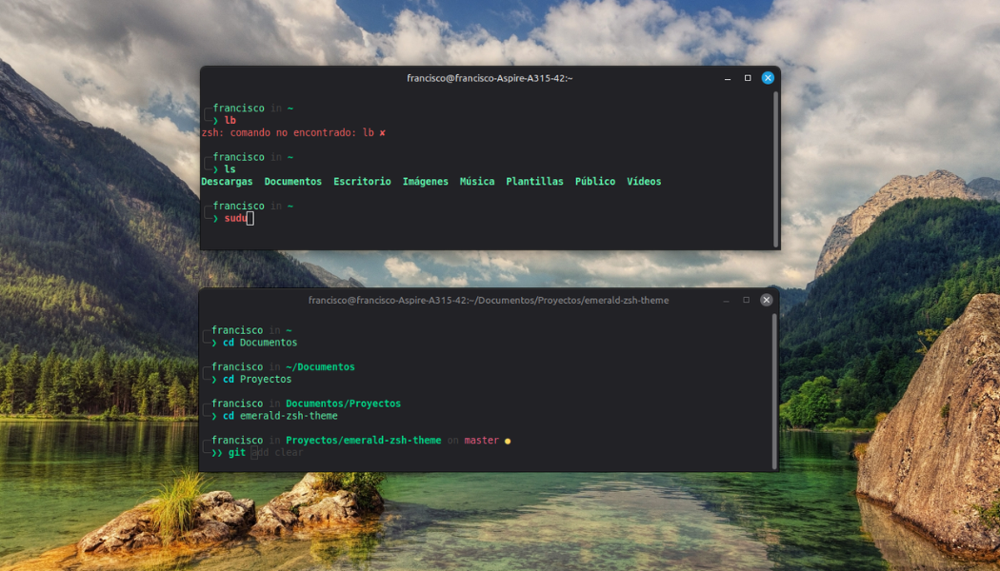

# Bearded Emerald — Zsh Theme

Un tema limpio, elegante y minimalista para Zsh con una paleta inspirada en **Bearded Theme** (Black & Emerald). Diseñado para mantener una excelente legibilidad y un flujo de trabajo ágil en la terminal sin saturar la pantalla.

---

## Descripción

**emerald-zsh** es un tema profesional para Oh My Zsh que combina la potencia visual con la simplicidad funcional. Cada elemento está cuidadosamente coloreado siguiendo la paleta Esmeralda, permitiéndote navegar y trabajar en la terminal de forma intuitiva.

---

## Vista Previa



### Paleta de Colores

| Elemento | Color | Hex |
|----------|-------|-----|
| Prompt principal, comandos y rutas | Verde Esmeralda | `#00e6a6` |
| Nombre de usuario, aliases y carpetas | Verde Menta | `#73fbfd` |
| Comandos internos (cd, echo, export) | Turquesa | `#00cec9` |
| Banderas, opciones y cambios pendientes | Dorado | `#ffeaa7` |
| Strings y ramas de Git | Rosa Coral | `#ff7675` |
| Estructura del prompt y autosugerencias | Gris Slate | `#3b4252` |

---

## Plugins Incluidos

- **git** — Muestra la rama activa y el estado del repositorio (● en verde si está al día, ● en dorado si hay cambios).
- **zsh-autosuggestions** — Sugiere comandos en gris tenue basados en tu historial.
- **zsh-syntax-highlighting** — Colorea los comandos en tiempo real alineados con la paleta esmeralda.

---

## Instalación

### Paso 1: Requisitos Previos

Primero, instala [Oh My Zsh](https://ohmyz.sh/):

```bash
sh -c "$(curl -fsSL https://raw.githubusercontent.com/ohmyzsh/ohmyzsh/master/tools/install.sh)"
```

### Paso 2: Copiar el Tema

Copia el archivo del tema a tu directorio de temas de Oh My Zsh:

```bash
cp emerald-zsh-theme.zsh-theme ~/.oh-my-zsh/custom/themes/
```

### Paso 3: Configurar .zshrc

Edita tu archivo `~/.zshrc` y establece el tema:

```bash
ZSH_THEME="emerald-zsh-theme"
```

### Paso 4: Recargar Configuración

Recarga tu configuración de Zsh:

```bash
source ~/.zshrc
```

---

##Créditos

- [**Oh My Zsh**](https://ohmyz.sh/) — Framework base para la gestión de temas y plugins

---

## Licencia

MIT — [@fcabrerapd](https://github.com/fcabrerapd)